# Translate documents with multiple pages using Asynchronous Batch Processing with Amazon Translate.

[Amazon Translate](https://aws.amazon.com/translate/) is a neural machine translation service that delivers fast, high-quality, affordable, and customizable language translation. With [asynchronous batch processing](https://docs.aws.amazon.com/translate/latest/dg/async.html) you can put a collection of documents in an Amazon Simple Storage Service (Amazon S3) bucket and start an asynchronous processing job to translate them. Amazon Translate sends the translated output document to a specified Amazon S3 bucket.

Here we show how to upload a foreign language document in the form of PDF or DOCX from your local machine to S3 then run a batch translate job to translate the document to your desired target language.

## Assumptions

For simplicity we assumed the following.
* The solution demonstrates Japanese to English document translation.
* The solution only demonstrated for PDF and DOCX format only.

## Solution Overview

In order for us to build this solution we need to do the following.

* [Create an Amazon SageMaker Studio](https://docs.aws.amazon.com/sagemaker/latest/dg/onboard-quick-start.html) 

OR

* [Create a SageMaker Notebook Instance](https://docs.aws.amazon.com/sagemaker/latest/dg/nbi.html)

* Upload Notebook, [Japanese_to_English_Translation.ipynb](notebooks/Japanese_to_English_Translation.ipynb).
* Run through all the steps in sequence in the notebook to
    * Create IAM Policies and Roles, S3 bucket, install packages
    * Upload pdf / docx documents to translate from local machine
    * Upload to S3 bucket and convert pdf to docx if necessary
    * Create translate batch job
    * Run job to translate japanese language documents to english

## Solution Architecture

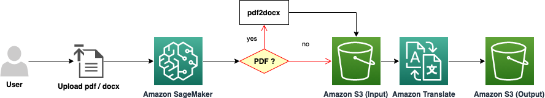

## Pre-requisites
- [Create AWS Account](https://aws.amazon.com/premiumsupport/knowledge-center/create-and-activate-aws-account/)
- Familiarity with [Amazon SageMaker](https://aws.amazon.com/sagemaker/), [Amazon S3](https://aws.amazon.com/s3/), [Amazon Translate](https://aws.amazon.com/translate/), [AWS IAM](https://aws.amazon.com/iam/)

## Things to be aware of

1. [Guidelines and Limits](https://docs.aws.amazon.com/translate/latest/dg/what-is-limits.html)
2. [Asynchronous Batch Processing Prerequisites](https://docs.aws.amazon.com/translate/latest/dg/async-prereqs.html)
----

## 1. Create an Amazon SageMaker Instance

Navigate to AWS Console, search and go to Amazon SageMaker console. Click on _**Notebook instances**_ under **Notebook** and click on _**Create notebook instance**_.

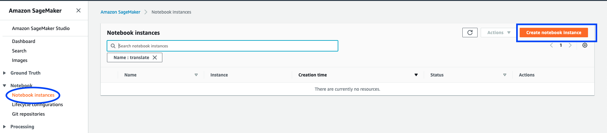

Enter _**Notebook instance name**_.

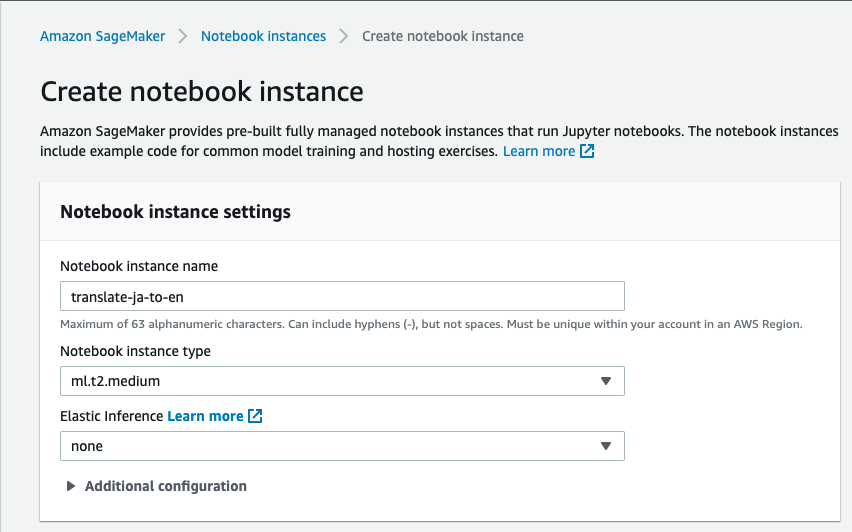

Create an IAM Role.

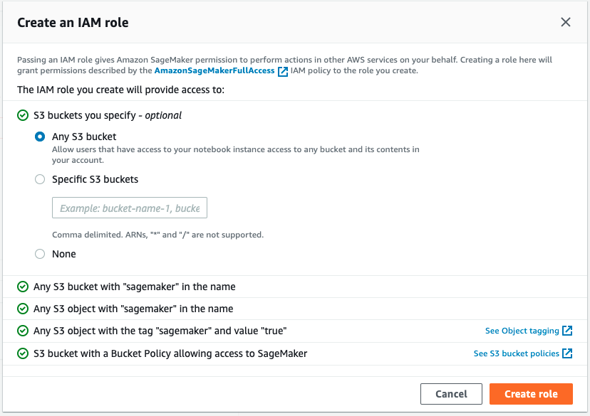

Make sure the AmazonSageMaker-ExecutionRole created has the following _AWS managed policy_ attached in addition.

 * IAMFullAccess
 * TranslateFullAccess

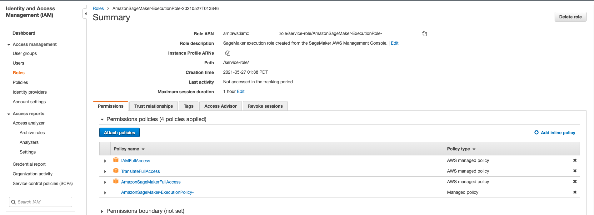

Keeping everything else default, click _**Create notebook Instance**_.

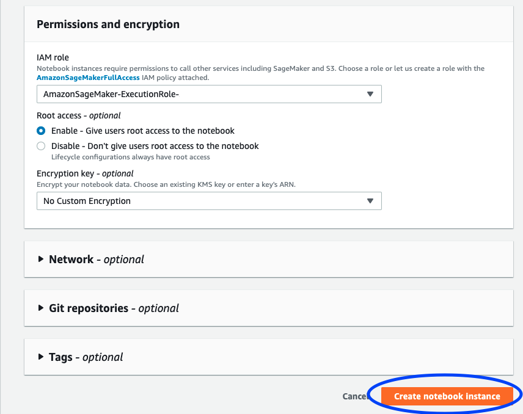

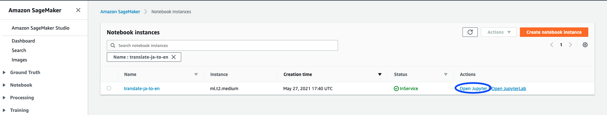

----

## 2. Upload Notebook and run translation

* Upload the notebook, [Japanese_to_English_Translation.ipynb](notebooks/Japanese_to_English_Translation.ipynb).

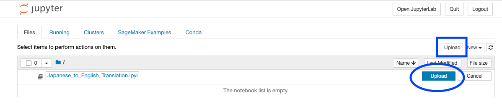

Once uploaded, click to open the notebook and run through all the steps sequentially to run the translation job. In section 2.1 use the FileUpload widget to upload test pdf and / docx japanese multi page test documents.

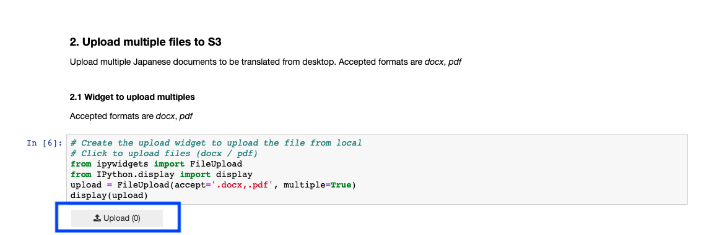

The number of Japanese language files selected from desktop to upload will show as below. Then run through the next steps.

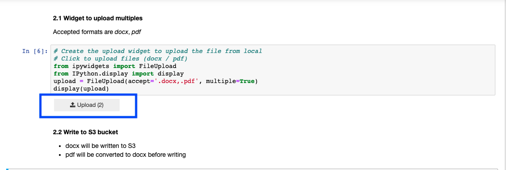

----

## 3. Verify the results

Keep running the section 3.2 in the notebook to make sure the Job Status says **COMPLETED** to denote the translation job completion.

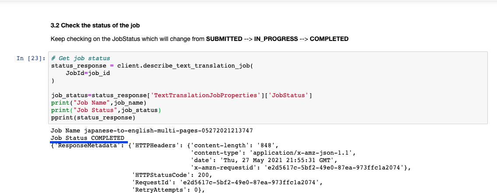

You can also check on the **Batch translation** job status from **Amazon Translate** console.

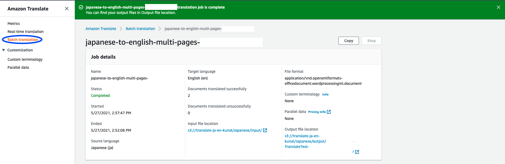

The input for translation can be found in the location denoted by **Input file location**.

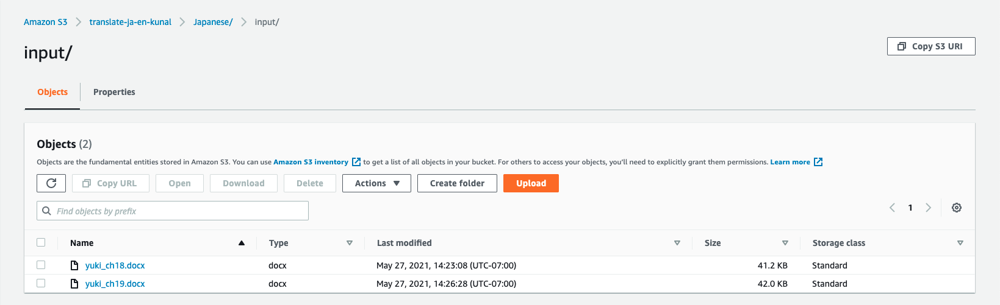

The output for translation can be found in the location denoted by **Output file location**.

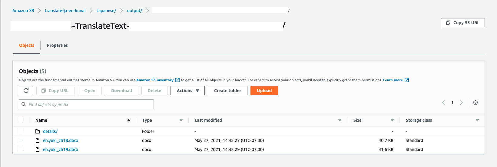

You can download the files to verify the input and output side by side.

----

## 4. Resources

* [Amazon Translate resources](https://aws.amazon.com/translate/resources/)

----

## Clean Up

Post testing, clean up all resource created to avoid incurring charges when resources are not in use.

----

## Conclusion

We showed you how you can translate multi page Japanese documents in the form of PDF / DOCX to English language using asynchronous batch processing with Amazon Translate. 

## Code of Conduct

See [CODE_OF_CONDUCT](CODE_OF_CONDUCT.md) for more information.

## Contributing Guidelines

See [CONTRIBUTING](CONTRIBUTING.md#security-issue-notifications) for more information.

## License

This library is licensed under the MIT-0 License. See the [LICENSE](LICENSE) file.